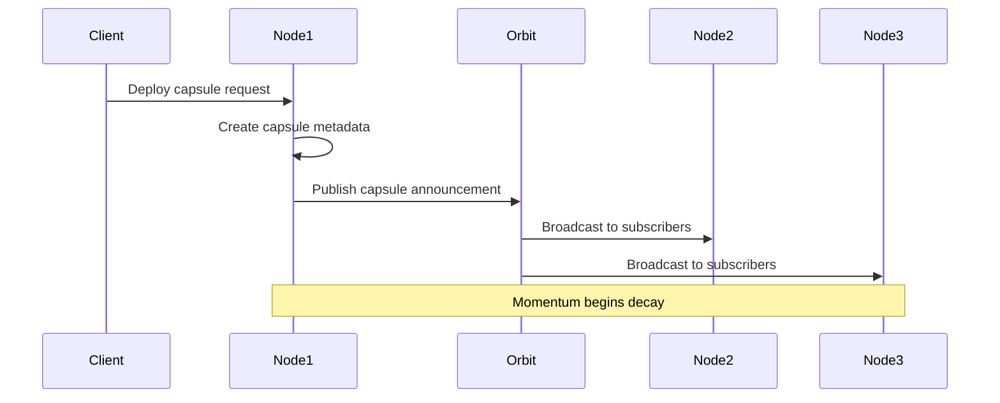
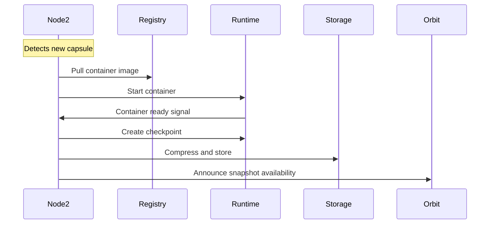
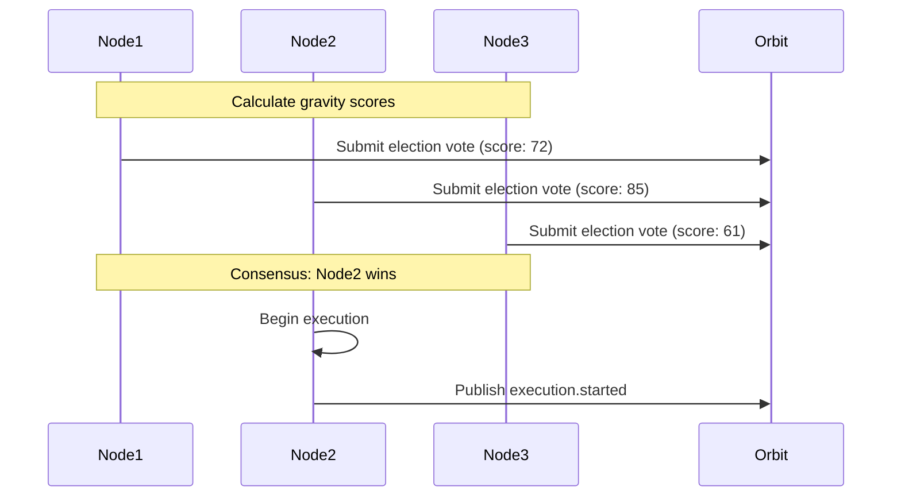
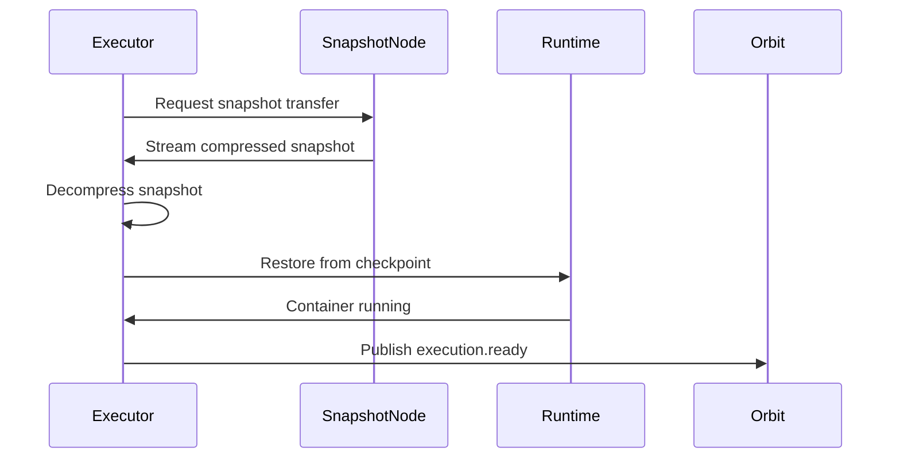

# Falak Capsule and Momentum Process: Technical Specification

## Table of Contents
1. [Overview](#overview)
2. [Core Design Principles](#core-design-principles)
3. [Capsule Architecture](#capsule-architecture)
4. [Orbit-Based Communication](#orbit-based-communication)
5. [Momentum System](#momentum-system)
6. [Snapshot Management](#snapshot-management)
7. [Node Election Process](#node-election-process)
8. [Technical Flow](#technical-flow)
9. [Performance Characteristics](#performance-characteristics)
10. [Error Handling and Fallback](#error-handling-and-fallback)
11. [Implementation Considerations](#implementation-considerations)

## Overview

Falak implements a novel orchestration-less container execution platform using physics-inspired abstractions. The system models distributed computing as a gravitational system where:

- **Capsules** are lightweight metadata packets describing deployable applications
- **Orbits** are PubSub topics representing logical execution paths
- **Momentum** represents the propagation and lifecycle energy of capsule events
- **Gravity** determines node affinity for executing specific capsules
- **Snapshots** are pre-initialized container states enabling near-instant startup

This specification details the technical implementation of capsule creation, momentum propagation, snapshot management, and the event-driven execution model.

## Core Design Principles

### 1. Orbit-Capsule Physics Model
- **Orbits as PubSub Topics**: Each orbit (e.g., `/orbit/api`, `/orbit/gpu`, `/orbit/ml`) is implemented as a libp2p gossipsub topic
- **Capsules as Metadata Packets**: Lightweight (1-10KB) JSON structures containing deployment specifications
- **Momentum as Event Energy**: Event propagation through the network with natural decay over time
- **Gravitational Attraction**: Nodes self-elect based on proximity, resources, and affinity

### 2. Local Storage Strategy
- **Local Metadata Storage**: Each node maintains capsule metadata and snapshot references locally
- **PubSub Coordination**: Event-driven communication for capsule announcements and snapshot availability
- **Decentralized Architecture**: No central orchestrator or state management

### 3. Event-Driven Execution
- **Publish-Subscribe Model**: All communication via libp2p pubsub (gossipsub protocol)
- **Asynchronous Processing**: Non-blocking event handling throughout the system
- **Natural Load Balancing**: Self-election prevents thundering herd problems

## Capsule Architecture

### Capsule Metadata Structure

#### JSON Schema
```json
{
  "id": "capsule-uuid-v4",
  "name": "my-api-service",
  "version": "1.2.3",
  "orbit": "/orbit/dc1/prod/api",
  "created_at": "2025-08-15T10:30:00Z",
  "expires_at": "2025-08-15T22:30:00Z",
  
  "container": {
    "image": "registry.example.com/my-api:1.2.3",
    "digest": "sha256:abc123...",
    "ports": [{"container": 8080, "host_range": "8080-8090"}],
    "env": {"DATABASE_URL": "postgres://..."},
    "mounts": [
      {"source": "/data", "target": "/app/data", "type": "bind"},
      {"source": "logs-volume", "target": "/app/logs", "type": "volume"}
    ],
    "resources": {
      "min_cpu_millicores": 250,
      "max_cpu_millicores": 1000,
      "min_memory_mb": 256,
      "max_memory_mb": 1024,
      "min_storage_mb": 512,
      "max_storage_mb": 2048,
      "requires_filesystem": true
    }
  },

  "deployment": {
    "min_instances": 1,
    "max_instances": 10,
    "target_instances": 2,
    "scaling": {
      "cpu_threshold": 70,
      "memory_threshold": 80,
      "request_rate_threshold": 1000,
      "scale_up_cooldown": 60,
      "scale_down_cooldown": 180
    }
  },

  "placement": {
    "datacenters": ["dc1", "dc2"],
    "clusters": ["prod-cluster-1", "prod-cluster-2"]
  },
  
  "snapshots": [
    {
      "node_id": "12D3KooW...",
      "created_at": "2025-08-15T10:25:00Z",
      "size_compressed": 45123456,
      "size_uncompressed": 125000000,
      "compression": "zstd",
      "checksum": "sha256:def456...",
      "transfer_protocol": "libp2p-stream"
    }
  ],
  
  "gravity": {
    "cpu_weight": 0.3,
    "memory_weight": 0.3,
    "latency_weight": 0.2,
    "affinity_weight": 0.2,
    "required_labels": ["zone=us-west"],
    "preferred_labels": ["ssd=true"]
  },
  
  "momentum": {
    "energy": 100,
    "decay": 0.1,
    "threshold": 10,
    "ttl": 300
  }
}
```

#### Protocol Buffers Schema
The complete protobuf schema is available at [`docs/capsule.proto`](./capsule.proto) with strongly-typed definitions for all capsule components, PubSub messages, and transfer protocols.

### Size Characteristics
- **Capsule Metadata**: 1-10KB (average 3KB)
- **Typical Container Image**: 50-500MB
- **Compressed Snapshot**: 30-150MB (60-75% reduction via zstd)
- **Transfer Time**: 2-15 seconds on 100Mbps connections

## Orbit-Based Communication

### Orbit Topic Structure
```
/orbit/{datacenter}/{cluster}/{category}

Examples:
- /orbit/dc1/prod/api           # API services in DC1 prod cluster
- /orbit/dc2/staging/gpu        # GPU workloads in DC2 staging cluster
- /orbit/*/prod/data            # Data services across all datacenters in prod
- /orbit/dc1/*/ml               # ML workloads in DC1, any cluster
- /orbit/*/*/edge               # Edge services globally

Wildcard Support:
- * = matches any single segment
- ** = matches multiple segments (future enhancement)
```

### PubSub Message Types

#### 1. Capsule Announcement
```json
{
  "type": "capsule.announced",
  "timestamp": "2025-08-15T10:30:00Z",
  "orbit": "/orbit/api",
  "capsule_id": "capsule-uuid",
  "momentum": 100,
  "source_node": "12D3KooW...",
  "capsule_metadata": { /* full capsule structure */ }
}
```

#### 2. Node Election
```json
{
  "type": "election.vote",
  "timestamp": "2025-08-15T10:30:05Z",
  "capsule_id": "capsule-uuid",
  "voter_node": "12D3KooW...",
  "gravity_score": 85.7,
  "vote_ttl": 30,
  "capabilities": {
    "cpu_available": 2000,
    "memory_available": 4096,
    "has_snapshots": true,
    "estimated_startup": 2.3
  }
}
```

#### 3. Execution Event
```json
{
  "type": "execution.started",
  "timestamp": "2025-08-15T10:30:15Z",
  "capsule_id": "capsule-uuid",
  "executor_node": "12D3KooW...",
  "method": "snapshot",
  "snapshot_source": "12D3KooW...",
  "estimated_ready": "2025-08-15T10:30:17Z"
}
```

## Momentum System

### Momentum Calculation
```go
type Momentum struct {
    Energy float64 `json:"energy"`
    Decay  float64 `json:"decay"`
    Threshold float64 `json:"threshold"`
    TTL    int     `json:"ttl"`
}

func (m *Momentum) CurrentEnergy(ageSeconds int) float64 {
    energy := m.Energy * math.Exp(-m.Decay * float64(ageSeconds))
    if energy < m.Threshold {
        return 0 // Capsule expires
    }
    return energy
}
```

### Momentum Decay Patterns
- **High Priority Capsules**: Slow decay (rate: 0.05), longer propagation
- **Standard Capsules**: Medium decay (rate: 0.1), balanced lifecycle
- **Batch Jobs**: Fast decay (rate: 0.2), quick execution or expiration

### Orbit Subscription Strategy
```go
// Nodes selectively subscribe to orbits based on capabilities
func (n *Node) ShouldSubscribeToOrbit(orbit string) bool {
    switch {
    case strings.Contains(orbit, "gpu") && !n.HasGPU():
        return false
    case strings.Contains(orbit, "edge") && n.DatacenterTier != "edge":
        return false
    default:
        return n.ComputeCapacity() > n.LoadThreshold()
    }
}
```

## Snapshot Management

### Snapshot Creation Process

1. **Volunteer Detection**: Nodes with available resources monitor for new capsules
2. **Image Download**: Pull container image from registry
3. **Container Initialization**: Start container and wait for ready state
4. **Memory Capture**: Create checkpoint using runtime-specific tools
5. **Compression**: Apply zstd compression (target 60-75% reduction)
6. **Storage**: Store locally and announce availability via PubSub

### Snapshot Storage Architecture

```go
type SnapshotStorage struct {
    LocalPath      string                 // /var/lib/falak/snapshots/
    Index          map[string]SnapshotRef // In-memory index
    CompressionAlg string                 // "zstd"
    MaxSizeGB      int                    // Storage limit per node
    RetentionDays  int                    // Automatic cleanup
}

type SnapshotRef struct {
    CapsuleID        string    `json:"capsule_id"`
    CreatedAt        time.Time `json:"created_at"`
    SizeCompressed   int64     `json:"size_compressed"`
    SizeUncompressed int64     `json:"size_uncompressed"`
    Checksum         string    `json:"checksum"`
    LocalPath        string    `json:"local_path"`
    Available        bool      `json:"available"`
}
```

### Compression Strategy
- **Algorithm**: Zstandard (zstd) for optimal compression ratio and speed
- **Target Reduction**: 60-75% size reduction
- **Trade-offs**: 2-5 second compression time vs 10-50x faster transfer

### Transfer Protocol
```go
// Direct libp2p stream transfer between nodes
func (n *Node) TransferSnapshot(targetNode peer.ID, snapshotRef SnapshotRef) error {
    stream, err := n.Host.NewStream(context.Background(), targetNode, "/falak/snapshot/1.0.0")
    if err != nil {
        return err
    }
    defer stream.Close()
    
    // Send snapshot metadata
    encoder := json.NewEncoder(stream)
    if err := encoder.Encode(snapshotRef); err != nil {
        return err
    }
    
    // Stream compressed snapshot data
    file, err := os.Open(snapshotRef.LocalPath)
    if err != nil {
        return err
    }
    defer file.Close()
    
    _, err = io.Copy(stream, file)
    return err
}
```

## Node Election Process

### Gravity Calculation
```go
type GravityCalculator struct {
    CPUWeight     float64 `json:"cpu_weight"`
    MemoryWeight  float64 `json:"memory_weight"`
    LatencyWeight float64 `json:"latency_weight"`
    AffinityWeight float64 `json:"affinity_weight"`
}

func (g *GravityCalculator) CalculateScore(node *Node, capsule *Capsule) float64 {
    cpuScore := float64(node.AvailableCPU()) / float64(capsule.RequiredCPU())
    memScore := float64(node.AvailableMemory()) / float64(capsule.RequiredMemory())
    latencyScore := 1.0 / (1.0 + node.AverageLatency().Seconds())
    affinityScore := g.calculateAffinityScore(node, capsule)
    
    return (cpuScore * g.CPUWeight +
            memScore * g.MemoryWeight +
            latencyScore * g.LatencyWeight +
            affinityScore * g.AffinityWeight) * 100
}
```

### Election Algorithm

1. **Capsule Announcement**: Published to orbit topic with momentum
2. **Vote Collection**: Nodes calculate gravity and submit votes (5-30 second window)
3. **Consensus Formation**: Nodes observe all votes and determine winner
4. **Execution Assignment**: Highest gravity score wins, ties broken by node ID
5. **Fallback Election**: If winner fails, second-highest automatically takes over

```go
type ElectionVote struct {
    NodeID        peer.ID   `json:"node_id"`
    GravityScore  float64   `json:"gravity_score"`
    Timestamp     time.Time `json:"timestamp"`
    HasSnapshot   bool      `json:"has_snapshot"`
    EstimatedTime int       `json:"estimated_startup_seconds"`
}

func (e *Election) DetermineWinner(votes []ElectionVote) peer.ID {
    sort.Slice(votes, func(i, j int) bool {
        if votes[i].GravityScore == votes[j].GravityScore {
            return votes[i].NodeID.String() < votes[j].NodeID.String() // Deterministic tiebreaker
        }
        return votes[i].GravityScore > votes[j].GravityScore
    })
    
    return votes[0].NodeID
}
```

## Technical Flow

### 1. Capsule Creation and Publishing



### 2. Snapshot Creation (Parallel Process)



### 3. Election and Execution



### 4. Snapshot Transfer and Restoration



## Performance Characteristics

### Timing Benchmarks
- **Capsule Announcement**: < 100ms (network propagation)
- **Election Window**: 5-30 seconds (configurable)
- **Snapshot Transfer**: 2-15 seconds (50-200MB over 100Mbps)
- **Container Restore**: 1-3 seconds (from compressed checkpoint)
- **Total Cold Start**: 8-50 seconds (without snapshots: 60-300 seconds)

### Network Efficiency
- **Metadata Overhead**: 1-10KB per capsule
- **Snapshot Compression**: 60-75% size reduction
- **PubSub Topics**: Selective subscription reduces bandwidth
- **Direct P2P Transfer**: O(1) snapshot transfer complexity

### Storage Requirements
- **Per Node Metadata**: 10-100MB (10,000 capsules)
- **Snapshot Storage**: 1-100GB per node (configurable)
- **Retention Policy**: 7-30 days (configurable)

### Scalability Limits
- **Network Size**: 1,000-10,000 nodes (libp2p gossipsub limits)
- **Capsules per Orbit**: 100-1,000 active capsules
- **Concurrent Elections**: 10-50 per node
- **Snapshot Transfers**: 5-20 concurrent per node

## Error Handling and Fallback

### Snapshot Fallback Strategy
```go
type ExecutionStrategy int

const (
    StrategySnapshot ExecutionStrategy = iota
    StrategyImage
    StrategyFailed
)

func (n *Node) ExecuteCapsule(capsule *Capsule) error {
    strategies := []ExecutionStrategy{
        StrategySnapshot, // Try snapshot first
        StrategyImage,    // Fall back to original image
    }
    
    for _, strategy := range strategies {
        switch strategy {
        case StrategySnapshot:
            if err := n.executeFromSnapshot(capsule); err == nil {
                return nil
            }
        case StrategyImage:
            if err := n.executeFromImage(capsule); err == nil {
                return nil
            }
        }
    }
    
    return ErrExecutionFailed
}
```

### Network Partition Handling
- **Local Mode**: Nodes continue executing with cached snapshots
- **Partition Detection**: Monitor peer connectivity and gossipsub health
- **Graceful Degradation**: Reduce new capsule acceptance during partitions
- **Recovery Protocol**: Automatic state synchronization when connectivity restores

### Consensus Failure Recovery
```go
func (e *Election) HandleConsensusFailure(capsuleID string) {
    // Wait for additional bids
    time.Sleep(e.ExtendedBidWindow)
    
    // Check if any node claimed execution
    if executor := e.GetExecutor(capsuleID); executor != nil {
        return // Someone took responsibility
    }
    
    // Trigger re-election with exponential backoff
    e.TriggerReElection(capsuleID, e.BackoffMultiplier)
}
```

## Implementation Considerations

### Runtime Support Matrix
| Runtime | Checkpointing | Restore Speed | Implementation Status |
|---------|---------------|---------------|----------------------|
| runc    | CRIU          | Fastest       | Planned              |
| Podman  | CRIU          | Fast          | Planned              |
| Docker  | Checkpoint API| Medium        | Planned              |
| WASM    | Native        | Fastest       | Future               |

### Security Considerations
- **Snapshot Integrity**: SHA256 checksums for all snapshots
- **Access Control**: Peer authentication via libp2p identity
- **Container Isolation**: Standard container security boundaries
- **Network Security**: Encrypted libp2p connections (TLS 1.3)

### Monitoring and Observability
```go
type Metrics struct {
    CapsulesAnnounced   prometheus.Counter
    ElectionsParticipated prometheus.Counter
    SnapshotsCreated    prometheus.Counter
    ExecutionTime       prometheus.Histogram
    NetworkLatency      prometheus.Histogram
    SnapshotTransferTime prometheus.Histogram
}
```

### Configuration Management
```yaml
# Node configuration
node:
  name: "falak-node-01"
  data_dir: "/var/lib/falak"
  max_snapshots_gb: 50
  
orbit_subscriptions:
  - "/orbit/api"
  - "/orbit/data/*"
  
gravity:
  cpu_weight: 0.3
  memory_weight: 0.3
  latency_weight: 0.2
  affinity_weight: 0.2

momentum:
  default_decay_rate: 0.1
  min_threshold: 10
  
snapshots:
  compression: "zstd"
  retention_days: 14
  max_concurrent_transfers: 10
```

### Development Roadmap
1. **Phase 1**: Basic capsule metadata and orbit communication
2. **Phase 2**: Simple election algorithm without snapshots
3. **Phase 3**: Snapshot creation and storage
4. **Phase 4**: Snapshot transfer and restoration
5. **Phase 5**: Advanced gravity calculations and momentum decay
6. **Phase 6**: Production hardening and monitoring

This specification provides the foundation for implementing Falak's capsule and momentum system, balancing theoretical elegance with practical implementation considerations.